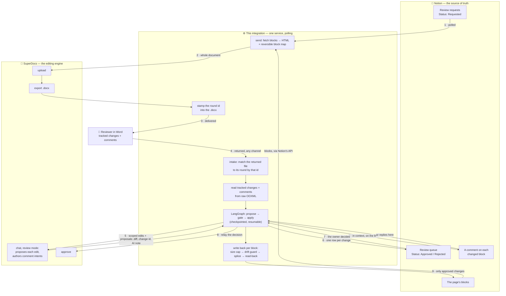

# Notion ⇄ Word review-cycle round-trip

**I built this for the SuperDocs task**, on the [SuperDocs](https://use.superdocs.app) API.

Your team's source of truth lives in Notion. Your reviewers — legal, a client, an editor — live in
Microsoft Word and have never opened Notion in their life. This closes that loop: a Notion page
goes out as a styled Word document, comes back marked up, and each change lands on the exact block
it came from — one approval at a time, with the reviewer's name attached.


*Above: a real page after two review rounds. Every highlighted passage was changed by a reviewer
working in Word; each margin comment records who asked for it and what it replaced; the round
reports `3 applied, 1 rejected, 2 skipped (page changed since review)`.*

## What it does

1. **A review starts in Notion.** Someone adds a row to a *Review requests* database — the page,
   who should review it — and sets Status to *Requested*. No terminal, no commands.
2. **SuperDocs turns the page into a styled `.docx`** and it's delivered to the reviewers. The file
   carries its own review-round id, so however it travels, it can find its way home.
3. **The reviewer works entirely in Word** — tracked changes and comments, the way they always
   have — and sends it back. They never see Notion, never sign in anywhere.
4. **SuperDocs proposes each change.** A tracked change goes out as a scoped edit; a free-form
   comment like *"make this less alarming"* is handed to SuperDocs' AI, which **writes the actual
   replacement text**. Each proposal comes back with the diff and an explanation.
5. **The page owner approves, in Notion** — a queue on the page, or a comment on the changed line
   itself. One decision per change.
6. **Approved changes land on the exact block**, block by block, with reviewer attribution and a
   provenance comment. Nothing else on the page is touched, and the page keeps a link to the round.

## How it works



**The gate is an operation, not a screen.** `InboundController` exposes approval; the Notion queue,
the inline comment and the terminal are all drivers of it. That is why a new interface costs almost
nothing — and why the same gate can be driven by a person or a program.

## SuperDocs surfaces used

| Surface | How |
|---|---|
| **Upload** | the whole Notion page, rendered to HTML, as one document |
| **Chat** *(review mode)* | proposes every reviewer change; **authors the edit** for a comment intent |
| **Review / approve** | each human decision is relayed against the change it belongs to |
| **Export** | produces the styled `.docx` the reviewer marks up |
| **Multi-document** | several Notion pages can go out as one review packet, each change fanning back to its own page |

Built on the REST API. The brief treats REST and MCP as interchangeable; REST was the shorter path
to the four calls, and an MCP surface over the same controller would be a small addition.

## What it accepts

- **In**: a Notion page, or several as one review packet. **Out**: a Word `.docx`.
  **Back**: that `.docx` with tracked changes (`w:ins`, `w:del`, `w:moveFrom`/`w:moveTo`, including
  revisions nested inside hyperlinks) and comments, from any Word-compatible editor.
- **Structures preserved across the round-trip**: headings, paragraphs, quotes, bulleted and
  numbered lists, to-dos, code blocks, toggles, callouts, tables, inline databases, and rich text
  (bold, italic, links, colour).
- **Domain**: any prose document a team keeps in Notion and sends for formal review — a PRD, a
  launch plan, a policy, a client deliverable, a contract summary.
- A second run means a different Notion page and different reviewer markup within that shape.

## Running it

Everything runs in Docker, so local matches CI byte for byte.

```bash
make demo    # the whole round-trip on deterministic fakes — no keys, no API calls, no cost
make check   # ruff + mypy --strict + the full keyless test suite
```

`make demo` is the one command to see it work: it sends a sample page, reads a real marked-up
`.docx`, proposes each change, gates them, and applies the approved ones — end to end, offline.

<details>
<summary><b>Running it live against Notion and SuperDocs</b></summary>

**1. Notion** — create an integration at `notion.so/my-integrations`, copy the token, and connect it
to the pages you want reviewable (**⋯ → Connections**). It needs *read/update/insert content* and
*read/insert comments*.

**2. SuperDocs** — get an API key from `use.superdocs.app` → Settings → API Keys.

**3. Configure** — `cp .env.example .env` and fill in:

```bash
PROVIDER=live
SUPERDOCS_API_KEY=your-superdocs-key-here
NOTION_TOKEN=your-notion-token-here
```

**4. Send a page and apply the review**

```bash
make send PAGE=<notion-page-id>      # writes review-<round>.docx, stamped with its round id
make review FILE=<returned.docx>     # approve each change in the terminal
make status                          # what every round is doing (ROUND=<id> for one in full)
```

**5. Or let it run itself.** Create the requests database once, put its id in `.env`, and run the
service — a team then starts reviews from Notion and never touches a terminal:

```bash
docker compose run --rm --no-deps app python -m notion_review.cli \
    init-requests --parent-page-id <a page shared with the integration>

make watch     # the service; add `--once` under cron for a scheduled job instead
```

`make status` shows every round, what became of each change, and the ids to trace it
through both services. `make test-postgres` runs the store against a real Postgres.

</details>

## Calls I made

Where the brief or the API was silent, I made a call and recorded it here.

- **A SuperDocs session holds one pending proposal set at a time.** I verified this live: with
  proposals pending, a second chat on that session returns `409 session_busy` and never clears. So
  a review larger than one operation goes out in batches of ≤25 sections, each gated and applied
  before the next — which is also the card's *"one approval at a time"*.
- **`approve` keys each change on `change_id`, not the documented `chunk_id`** (which returns a
  500). Reverse-engineered and verified against the live API.
- **A reviewer's question is never sent to the AI.** A comment ending in "?" goes to the page owner
  instead, so the AI can't fabricate an answer into the document. Deliberately conservative, with
  the human gate as the backstop.
- **Decisions are polled, not pushed.** Notion's button blocks are unsupported by its public API, so
  a database row is what an integration can actually offer. Polling suits a review measured in hours
  or days and keeps this to one moving part.
- **Reviewer attribution is provenance, not authenticated identity** — Word author names are
  self-declared strings, and I report them faithfully without claiming more.
- **I did not ship an email sender without an email intake.** Telling a reviewer to reply to a
  mailbox nothing reads is a promise the system can't keep, so delivery is a folder — real when
  synced to a shared drive — and both halves of email belong behind the existing seams together.

## What it guarantees

- **Surgical.** Only blocks a reviewer changed are written, and only the span that differs — the
  rest of a block's bold, links and colour survive untouched.
- **Never a silent overwrite.** If the page changed while it was out for review, the change is
  surfaced as a conflict instead of clobbering the newer edit.
- **Never bluffs.** A change is *applied* only after the block is re-read and confirmed.
- **Idempotent where it costs money.** A crash and re-run re-spends no SuperDocs operation and
  double-applies nothing.
- **Resumable.** The gate is a checkpointed interrupt, so a review can pause for days and resume.
- **Untrusted input is treated as such.** The `.docx` is read behind zip-bomb and XXE defenses;
  reviewer text is sanitised before it reaches the AI; links an edit would introduce are surfaced
  at the gate; oversized edits are refused; content lands as text, never as markup.
- **No secret in code, logs, or history.** Every log line is scrubbed of tokens before it's emitted.

135 tests run without an API key, plus a Postgres-backed store test. I verified the one-command
claim by cloning the repository fresh, with no `.env`.

## Limitations

- **One workspace per deployment** — a single Notion integration token, not per-workspace OAuth.
- **Email isn't a channel yet.** Documents move through folders, which is real when synced to a
  shared drive, but not the same as a reviewer replying to a message.
- **Table cells can't be targeted individually**, and a **toggle's title doesn't round-trip** —
  SuperDocs re-chunks a table as one unit and drops a toggle's summary text on upload. Both are
  surfaced rather than guessed at, and both are reported as bugs.
- **Decisions apply within one poll interval** (ten seconds by default), not instantly.
- **No notifications** — the page is commented and updated, but nobody is emailed.

Engineering notes, architecture decisions and the full assumption log are in
[PROGRESS.md](PROGRESS.md).
