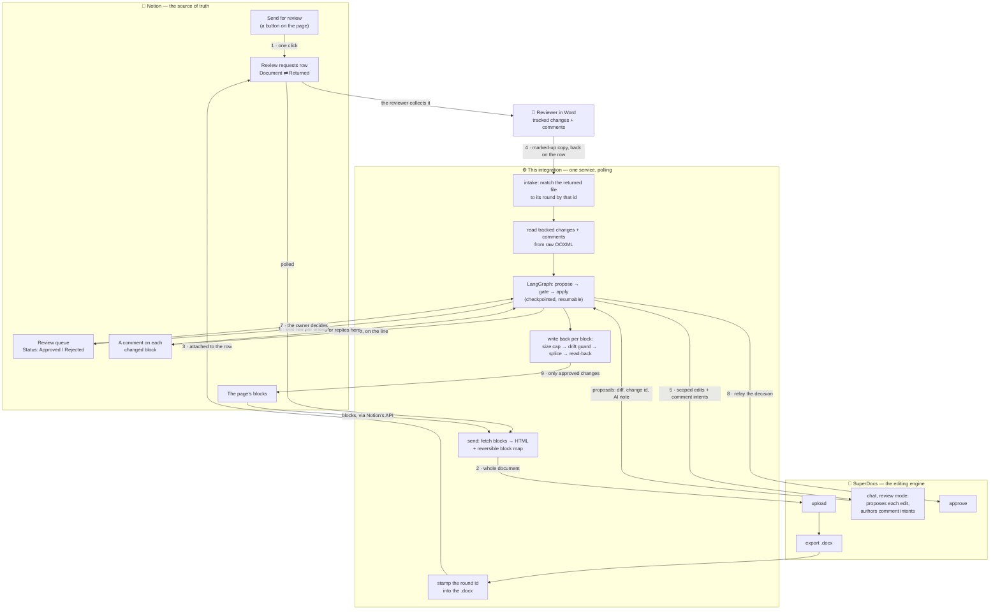

# Notion ⇄ Word review-cycle round-trip

**I built this for the SuperDocs task**, on the [SuperDocs](https://use.superdocs.app) API.

Your team's source of truth lives in Notion. Your reviewers — legal, a client, an editor — live in
Microsoft Word and have never opened Notion in their life. This closes that loop: a Notion page
goes out as a styled Word document, comes back marked up, and each change lands on the exact block
it came from — one approval at a time, with the reviewer's name attached.


*Above: a real page after two review rounds. Every highlighted passage was changed by a reviewer
working in Word; each margin comment records who asked for it and what it replaced; the round
reports `3 applied, 1 rejected, 2 skipped (page changed since review)`.*

## What it does

1. **A review starts with one button in Notion.** A *Send for review* button on the page adds a row
   to a *Review requests* database. No terminal, no commands, no second app.
2. **SuperDocs turns the page into a styled `.docx`**, and it appears attached to that same row,
   moments later. The file carries its own review-round id, so however it travels it finds its way
   home.
3. **The reviewer works entirely in Word** — tracked changes and comments, the way they always
   have — and puts the marked-up copy back on the row. They never see Notion, never sign in
   anywhere. Send it to several reviewers and every copy comes back to the same row.
4. **SuperDocs proposes each change.** A tracked change goes out as a scoped edit; a free-form
   comment like *"make this less alarming"* is handed to SuperDocs' AI, which **writes the actual
   replacement text**. Each proposal comes back with the diff and an explanation.
5. **The page owner approves, in Notion** — a queue on the page, or a comment on the changed line
   itself. One decision per change, and if two reviewers rewrote the same line the queue says so
   before anything is decided.
6. **Approved changes land on the exact block**, block by block, with reviewer attribution and a
   provenance comment. Nothing else on the page is touched, and the page keeps a link to the round.

From end to end, the owner never leaves Notion and the reviewer never leaves Word.

## How it works



**The gate is an operation, not a screen.** `InboundController` exposes approval; the Notion queue,
the inline comment and the terminal are all drivers of it. That is why a new interface costs almost
nothing — and why the same gate can be driven by a person or a program.

## SuperDocs surfaces used

| Surface | How |
|---|---|
| **Upload** | the whole Notion page, rendered to HTML, as one document |
| **Chat** *(review mode)* | proposes every reviewer change; **authors the edit** for a comment intent |
| **Review / approve** | each human decision is relayed against the change it belongs to |
| **Export** | produces the styled `.docx` the reviewer marks up |
| **Multi-document** | several Notion pages go out as one review packet, each change fanning back to its own page — verified live on two real pages, one export, one operation |

Built on the REST API. The brief treats REST and MCP as interchangeable; REST was the shorter path
to the four calls, and an MCP surface over the same controller would be a small addition.

## What it accepts

- **In**: a Notion page, or several as one review packet. **Out**: a Word `.docx`.
  **Back**: that `.docx` with tracked changes (`w:ins`, `w:del`, `w:moveFrom`/`w:moveTo`, including
  revisions nested inside hyperlinks) and comments, from any Word-compatible editor.
- **Structures preserved across the round-trip**: headings, paragraphs, quotes, bulleted and
  numbered lists, to-dos, code blocks, toggles, callouts, tables, inline databases, and rich text
  (bold, italic, links, colour).
- **Domain**: any prose document a team keeps in Notion and sends for formal review — a PRD, a
  launch plan, a policy, a client deliverable, a contract summary.
- A second run means a different Notion page and different reviewer markup within that shape.

## Running it

Everything runs in Docker, so local matches CI byte for byte.

```bash
make demo    # the whole round-trip on deterministic fakes — no keys, no API calls, no cost
make check   # ruff + mypy --strict + the full keyless test suite
```

`make demo` is the one command to see it work: it sends a sample page, reads a real marked-up
`.docx`, proposes each change, gates them, and applies the approved ones — end to end, offline.

<details>
<summary><b>Running it live against Notion and SuperDocs</b></summary>

**1. Notion** — create an integration at `notion.so/my-integrations`, copy the token, and connect it
to the pages you want reviewable (**⋯ → Connections**). It needs *read/update/insert content* and
*read/insert comments*.

**2. SuperDocs** — get an API key from `use.superdocs.app` → Settings → API Keys.

**3. Configure** — `cp .env.example .env` and fill in:

```bash
PROVIDER=live
SUPERDOCS_API_KEY=your-superdocs-key-here
NOTION_TOKEN=your-notion-token-here
```

**4. Run it as a service — the way a team actually uses it.** Create a requests board once, then
start the service. Nothing is configured afterwards and nobody touches a terminal again.

```bash
docker compose run --rm --no-deps app python -m notion_review.cli \
    init-requests --parent-page-id <a page shared with the integration>

make watch     # add `--once` under cron for a scheduled job instead of a long-running process
```

**Boards are found, not configured.** The service serves every *Review requests* database that has
been shared with the integration — Notion's search only ever returns what someone explicitly shared
with the connection, so **sharing a board is how a team switches this on, and unsharing it is how
they switch it off**. Five teams with five boards need no more setup than one, a board shared while
the service is running is picked up within a minute without a restart, and no database id is ever
copied into an environment file. Set `NOTION_REQUESTS_DB` only to pin one deployment to exactly one
board in a workspace holding several.

**5. Add the button.** On any page you want reviewable, add a Notion **Button** block — *Add page
to* → *Review requests*, with **Page URL** set to the page and **Status** to `Requested`. That is
the whole trigger, and it is why nobody needs a command:

```
[Send for review]  ← a button on the page
      ↓
  a row appears → the styled .docx is attached to it → the reviewer marks it up in Word
      ↓                                                            │
  the page updates ◄── the owner approves, in Notion ◄── dropped back on the row
```

The document goes out on the row and the marked-up copies come back on the row, so the whole
handoff stays inside Notion. A reviewer who has access to that database collects the file and drops
their copy back themselves; an outside reviewer — legal, a client — is sent it by the owner from
Notion, and their reply goes back on the row the same way. Several reviewers can each put their own
copy on the same row, and each copy is taken in on its own.

Set `HANDOFF=folder` to use watched directories instead (`outbox/` out, `inbox/` back) — a real
channel when they are inside a synced shared drive, and what a deployment without a requests
database falls back to. Email would be a third channel behind the same two seams, and belongs there
only as a pair: sending a reviewer a document while having no inbox to receive their reply would
promise something the system cannot keep.

**Or drive it by hand** — the same gate, approved in the terminal instead of in Notion. Useful for
trying it once, for CI, or for debugging without setting up the requests database:

```bash
make send PAGE=<notion-page-id>      # writes review-<round>.docx, stamped with its round id
make review FILE=<returned.docx>     # approve each change in the terminal, y/n
make status                          # what every round is doing (ROUND=<id> for one in full)
```

`make status` shows every round, what became of each change, and the ids to trace it through both
services. `make test-postgres` runs the store against a real Postgres.

</details>

## Calls I made

Where the brief or the API was silent, I made a call and recorded it here.

- **A SuperDocs session holds one pending proposal set at a time.** I verified this live: with
  proposals pending, a second chat on that session returns `409 session_busy` and never clears. So
  a review larger than one operation goes out in batches of ≤25 sections, each gated and applied
  before the next — which is also the card's *"one approval at a time"*.
- **`approve` keys each change on `change_id`, not the documented `chunk_id`** (which returns a
  500). Reverse-engineered and verified against the live API.
- **A reviewer's question is never sent to the AI.** A comment ending in "?" goes to the page owner
  instead, so the AI can't fabricate an answer into the document. Deliberately conservative, with
  the human gate as the backstop.
- **Decisions are polled, not pushed.** Notion's button blocks can't be *created* through the public
  API, but a person can add one and point it at the requests database — so the trigger is a real
  button and the integration reads the row it writes. Polling suits a review measured in hours or
  days and keeps this to one moving part.
- **Which boards to serve is discovered, not configured.** Which databases exist is a fact about the
  workspace, not about the deployment, and Notion already has the right primitive: search returns
  exactly what has been shared with the connection. So a team enables this with the same gesture
  that grants access, and an environment file never learns a database id. A configured id survives
  only as a pin for a deployment that should serve one board out of several.
- **A round takes in one file per reviewer, keyed by content.** Every reviewer marks up their own
  copy, so identity belongs to the submission and not the round: the same file twice is free, a
  different file is another reviewer. A copy that arrives while changes are still at the gate waits
  its turn, because a SuperDocs session holds one pending proposal set at a time.
- **Competing changes are named, not resolved.** Only one rewrite of a line can land; the rest are
  refused by the drift guard rather than overwriting a colleague. The queue says which changes
  compete before the owner decides, and never picks between them.
- **Reviewer attribution is provenance, not authenticated identity** — Word author names are
  self-declared strings, and I report them faithfully without claiming more.
- **I did not ship an email sender without an email intake.** Telling a reviewer to reply to a
  mailbox nothing reads is a promise the system can't keep. Both halves of email belong behind the
  existing seams together, the way the Notion-row and folder channels already do.

## What it guarantees

- **Surgical.** Only blocks a reviewer changed are written, and only the span that differs — the
  rest of a block's bold, links and colour survive untouched.
- **Never a silent overwrite.** If the page changed while it was out for review, the change is
  surfaced as a conflict instead of clobbering the newer edit — including when the change that
  moved it was another reviewer's, on the same line.
- **No reviewer is dropped.** A round takes in a copy from every reviewer, each identified by its
  contents, and merges them into one queue. The same file arriving twice costs nothing.
- **Never bluffs.** A change is *applied* only after the block is re-read and confirmed.
- **Idempotent where it costs money.** A crash and re-run re-spends no SuperDocs operation and
  double-applies nothing.
- **Resumable.** The gate is a checkpointed interrupt, so a review can pause for days and
  resume — the round store and the graph checkpoint live in a mounted `data/` directory, so
  they outlive the container that created them.
- **Untrusted input is treated as such.** The `.docx` is read behind zip-bomb and XXE defenses;
  reviewer text is sanitised before it reaches the AI; links an edit would introduce are surfaced
  at the gate; oversized edits are refused; content lands as text, never as markup.
- **No secret in code, logs, or history.** Every log line is scrubbed of tokens before it's emitted.

155 tests run without an API key, plus a Postgres-backed store test. I verified the one-command
claim by cloning the repository fresh, with no `.env`.

## Limitations

- **One workspace per deployment** — a single Notion integration token, not per-workspace OAuth.
  Within that workspace any number of teams and boards are served without configuration.
- **An outside reviewer still needs sending the file.** Inside the workspace the loop is
  hands-free; for a reviewer with no Notion access the owner forwards the document from the row and
  puts the reply back on it. Email would close that hop and is the next channel behind these seams.
- **Notion caps an attachment at 5 MiB on a free workspace** (5 GiB on a paid one). A prose page
  exports far below that, but a very large document would need the folder channel.
- **Two reviewers editing the same paragraph in one file** are merged by Word into a single
  resulting text, which I attribute to the first author. The text is right; the attribution is
  lossy. Separate copies, one per reviewer, keep attribution exact.
- **Table cells can't be targeted individually**, and a **toggle's title doesn't round-trip** —
  SuperDocs re-chunks a table as one unit and drops a toggle's summary text on upload. Both are
  surfaced rather than guessed at, and both are reported as bugs.
- **Decisions apply within one poll interval** (fifteen seconds by default), not instantly.
- **No notifications** — the page is commented and updated, but nobody is emailed.

Engineering notes, architecture decisions and the full assumption log are in
[PROGRESS.md](PROGRESS.md).
